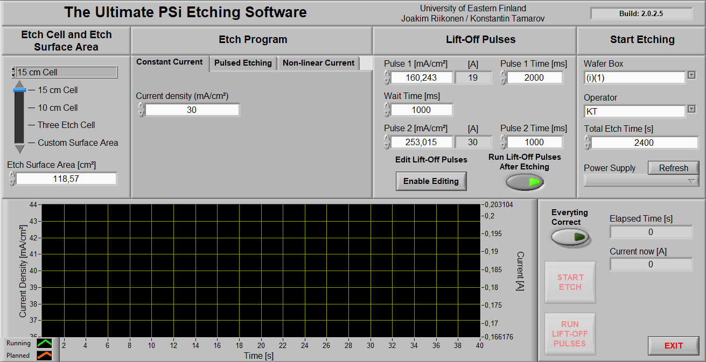

# Ultimate PSi Etching

A NI LabVIEW-based software for electrochemical anodization of Si wafers.

## Features

- Preistalled etching cells, which can be edited [here](./init/Etch_Cells.csv).
- Three different etching regimes: constant current, pulsed etching, and non-linear current.
- Preinstalled wafer liftoff pulses, which can be edited [here](./init/Etch_Cells.csv).
- Selection of power supplies, which can be edited [here](./init/Power_Supplies.csv).
- Logging of performed etching.
- Wafer liftoff pulses can be run separately.

## Requirements

- NI LabVIEW runtime and NI MAX must be installed on a PC/laptop to run the executable.
- For development, NI LabVIEW Development System must be installed.

## Use

- Check that NI MAX finds your power supply.
- Download the archive from the latest [release](https://github.com/naitsok/ultimate-psi-etching/releases/).
- Unpack the archive and run the Ultimate PSi Etching.exe.

## Credits

Ultimate PSi Etching has been developed by Joakim Riikonen and Konstantin Tamarov.

Licence: GPLv3.

When using please cite the Ultimate PSi Etching and this repository:

To cite the latest version:

J. Riikonen, K. Tamarov, V.-P. Lehto. 2022. Ultimate PSi Etching. [DOI: 10.5281/zenodo.6627793](https://doi.org/10.5281/zenodo.6627793).

To cite the specific version, select the DOI of specific version on [Zenodo page](https://doi.org/10.5281/zenodo.6627793):

J. Riikonen, K. Tamarov, V.-P. Lehto. 2022. Ultimate PSi Etching. 2022. DOI: (Use DOI of specific version).